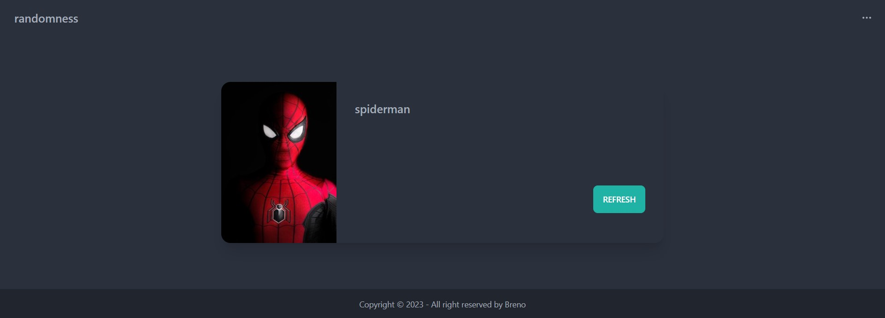
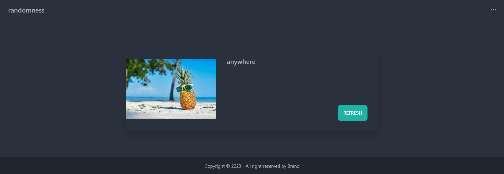
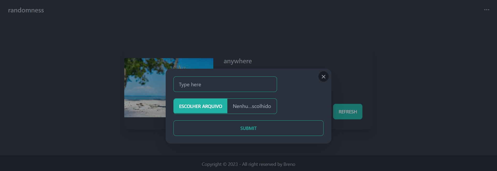

# Task Manager

## 👀 Como ficou o frontend ???

</img>
----------
</img>
----------
</img>
----------

## ⌨️ Sobre o projeto

O projeto consiste numa api java , Ele foi criado utilizando [Spring Boot](https://start.spring.io/).

## Sobre a API

- Método GET -> / (retorna aleatoriamente uma frase e uma imagem sobre essa frase)
- Método POST -> / (possibilita adicionar uma imagem e uma frase)

## 🧑‍💻 Tecnologias usadas

O projeto foi desenvolvido com as seguintes tecnologias:
- [Java](https://www.java.com/pt-BR/)
- [MYSQL](https://www.mysql.com/)